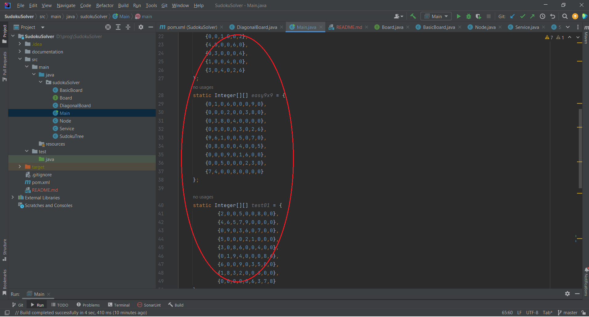
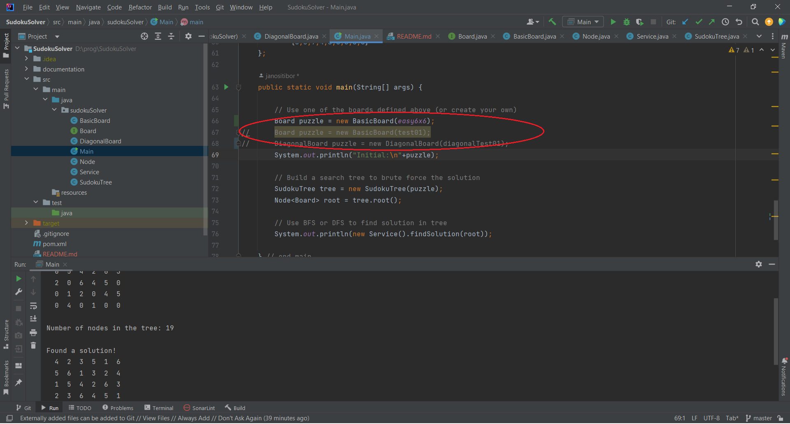
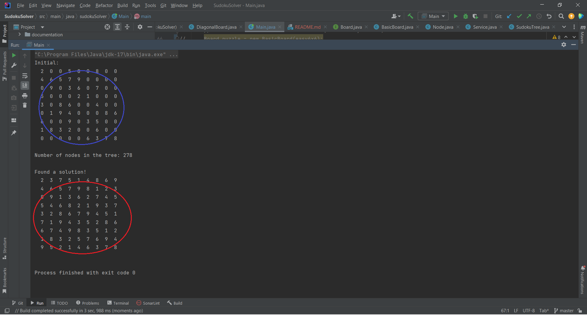

# Sudoku solver

## Purpose
* This project provide classes for the background calculation for solving a sudoku problem.
* It can be used for the following type of sudoku boards:
	* 4x4
	* 6x6
	* 9x9
	* 9x9 diagonal
* This project does not have any user surface ...

## Install
* Clone the Maven project in this repository to your local drive.

## Use
* Edit the source code with your favourite text editor or IDE.
* There is an example for the usage in the main class (.sr/main/java/sudokuSolver/Main.java).
* Define a new board (i.e. an integer matrix) according to the actual problem. Examples are available between the 6th and 61st row of the Main.java.
	* Blank fields are filled with 0's.
    
* Construct a new DiagonalBoard or Board with the recently defined board as an input parameter, as you can see in the rows 66-68.
    * In case you do not want to edit the rest of the code, the name of this object have to be "puzzle" independently of the type of board.
    
* Build and run your *.jar file.
* An appropriate solution will be the output on the terminal.
    
